# get_irq_priority

> [English Version](./README.md)  
> 当前页：简体中文

在 RT-Thread 中查看 Cortex®-M 内核 NVIC 中断优先级，并通过 MSH 命令按编号或按优先级排序显示已使能中断信息。该软件包的输出风格参考了 Keil 调试视图中的 NVIC 信息展示。

- 📘 在线文档: <https://wdfk-prog.space/rt-thread-get_irq_priority/>

## 1. 项目概览

`get_irq_priority` 是一个适用于 RT-Thread 的调试辅助软件包，主要用于：

- 查看当前**已使能**的中断；
- 显示中断号、IRQ 名称、Pending/Active 状态以及优先级；
- 按 **IRQ 编号** 或 **中断优先级** 排序输出；
- 在运行时通过命令行临时设置指定 IRQ 的优先级。

该组件面向 Cortex-M 内核的 NVIC 查询场景，适合用于：
- BSP bring-up；
- 中断冲突排查；
- 驱动调试；
- 优先级配置核对；
- 与 Keil / CubeMX / CMSIS 配置结果交叉验证。

## 2. 当前支持范围

从源码和头文件实现来看，当前软件包已经内置以下 STM32 系列的 IRQ 名称表：

- STM32F0
- STM32F1
- STM32F2
- STM32F3
- STM32F4
- STM32F7
- STM32G0
- STM32G4
- STM32H7
- STM32L0
- STM32L4

### 已在 README 中给出的验证示例

- STM32H750
- STM32F747
- STM32F429
- STM32F103

## 3. 工作原理

本软件包通过 CMSIS 提供的 NVIC 接口读取运行时中断状态信息，包括：

- `NVIC_GetEnableIRQ()`
- `NVIC_GetPendingIRQ()`
- `NVIC_GetActive()`
- `NVIC_GetPriority()`
- `NVIC_SetPriority()`

输出信息同时覆盖两类对象：

1. **Cortex-M 异常类型（Exception Type）**  
   如 `NonMaskableInt_IRQn`、`HardFault_IRQn`、`MemManage_IRQn`、`PendSV_IRQn`、`SysTick_IRQn` 等。

2. **外部中断（IRQ）**  
   即芯片 IRQ 表中定义的设备中断项。

默认命令会先输出异常类型，再输出当前已使能的 IRQ 信息。

## 4. 目录结构

```text
get_irq_priority
├── figures/                 # README 使用的截图资源
├── inc/                     # 不同 STM32 系列的 IRQ 名称表
│   ├── irq_stm32f0.h
│   ├── irq_stm32f1.h
│   ├── irq_stm32f2.h
│   ├── irq_stm32f3.h
│   ├── irq_stm32f4.h
│   ├── irq_stm32f7.h
│   ├── irq_stm32g0.h
│   ├── irq_stm32g4.h
│   ├── irq_stm32h7.h
│   ├── irq_stm32l0.h
│   └── irq_stm32l4.h
├── src/
│   └── get_irq.c            # 核心实现与 MSH 命令入口
├── Kconfig                  # 软件包配置入口
├── LICENSE                  # LGPL-2.1
├── SConscript               # RT-Thread 构建脚本
└── readme.md                # 原始 README（建议统一为 README.md）
```

## 5. 依赖项

使用本软件包前，请确认工程满足以下条件：

- 已启用 **RT-Thread MSH / FinSH**；
- 已正确注册控制台设备；
- 使用的是 **STM32 Cortex-M** 平台；
- 工程中可正常访问 CMSIS 和芯片 IRQ 定义。

### Kconfig 约束

当前 `Kconfig` 中包含：

```kconfig
depends on SOC_FAMILY_STM32
```

这意味着在线软件包菜单中，该组件默认只会在 STM32 SoC 家族配置满足时显示。

## 6. 获取与集成

### 方式一：手动集成

1. 下载或复制 `get_irq_priority` 软件包目录；
2. 将该目录放入工程可管理的位置；
3. 将 `src/get_irq.c` 加入工程构建；
4. 确保对应芯片系列宏已生效，例如 `SOC_SERIES_STM32H7`、`SOC_SERIES_STM32F4` 等；
5. 重新编译工程。

### 方式二：通过 RT-Thread Env / Studio 启用

可通过软件包管理界面启用：

`RT-Thread online packages -> miscellaneous packages -> get_irq_priority`

当 `SOC_FAMILY_STM32` 未被正确选择时，菜单中可能无法显示该软件包。此时需要先检查 BSP 的 SoC/Kconfig 配置。

## 7. 命令说明

软件包注册的命令为：

```bash
nvic_irq
```

支持以下用法。

### 7.1 默认模式

```bash
nvic_irq
```

行为：
- 先输出 Cortex-M 异常类型信息；
- 再输出当前**已使能**的外部中断；
- 外部中断部分按 **IRQ 编号升序** 输出。

适合用于整体巡视当前 NVIC 状态。

### 7.2 按 IRQ 编号排序

```bash
nvic_irq num
```

行为：
- 仅输出当前已使能的外部中断；
- 按 **IRQ 编号升序** 排列。

### 7.3 按优先级排序

```bash
nvic_irq priority
```

行为：
- 仅输出当前已使能的外部中断；
- 按 **中断优先级从低到高** 排列。

> 注意  
> 这里的“从低到高”沿用源码中的说明与实现表达。实际项目中建议结合芯片优先级编码规则理解“数值大小”和“抢占优先级高低”的关系，避免把“优先级值更小”与“逻辑优先级更低”混为一谈。

### 7.4 设置中断优先级

```bash
nvic_irq set <IRQn> <priority>
```

示例：

```bash
nvic_irq set 25 3
```

行为：
- 直接在运行时调用 `NVIC_SetPriority(IRQn, priority)`；
- 仅影响当前运行状态；
- 不会自动回写到工程静态配置中。

参数约束：
- `IRQn` 需要落在当前 IRQ 表范围内；
- `priority` 允许范围为 `0 ~ 15`。

## 8. 输出字段说明

命令输出表头如下：

```text
num IRQ name                       E P A Priotity
--- --------                       - - - --------
```

各列含义如下：

- `num`：IRQ 编号
- `IRQ name`：中断名称
- `E`：Enable，是否已使能
- `P`：Pending，是否处于挂起状态
- `A`：Active，是否处于激活状态
- `Priotity`：当前读取到的优先级值

> 说明  
> 源码和原 README 中字段拼写为 `Priotity`，这是现有实现的输出文本。若后续维护源码，建议统一修正为 `Priority`。

## 9. 排序逻辑说明

### 编号排序
`nvic_irq` 和 `nvic_irq num` 最终都按 IRQ 编号顺序输出已使能中断。

### 优先级排序
`nvic_irq priority` 会先把已使能中断的优先级读入缓存，再进行排序后输出。

因此：
- 它更适合快速检查“哪些中断当前优先级相同或接近”；
- 适合排查抢占关系、时序异常或优先级反转问题。

## 10. 典型使用场景

- 板级初始化后确认关键外设中断是否已使能；
- 检查 DMA、UART、TIM、EXTI 等中断的优先级分配；
- 对照 Keil 调试视图确认 NVIC 配置是否一致；
- 验证驱动初始化顺序是否引入异常优先级覆盖；
- 临时调整 IRQ 优先级并观察系统行为变化。

## 11. 示例截图

### 11.1 原理与界面对照

CMSIS/NVIC 查询原理说明：

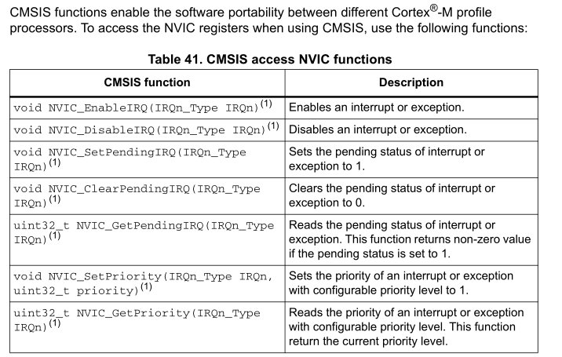

与 Keil NVIC 视图风格对照：

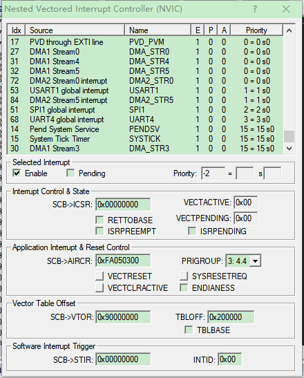

### 11.2 通用命令示例

默认输出示例：

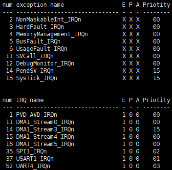

按优先级排序示例：

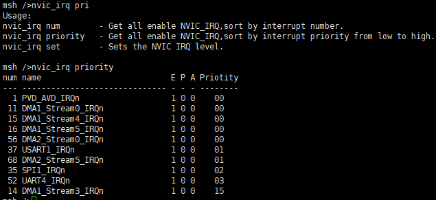

设置优先级示例：

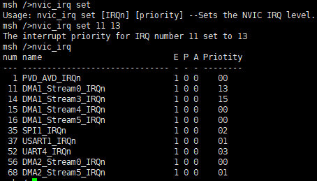

### 11.3 平台验证截图

#### STM32H750
默认查询：

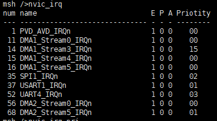

优先级排序：


设置优先级：


#### STM32F747
默认查询：

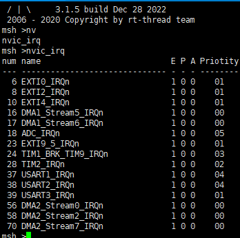

优先级排序：

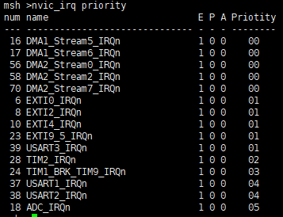

#### STM32F429
默认查询：

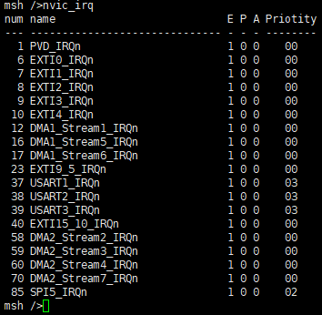

优先级排序：

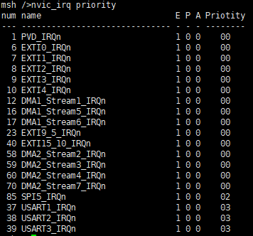

#### STM32F103
默认查询：

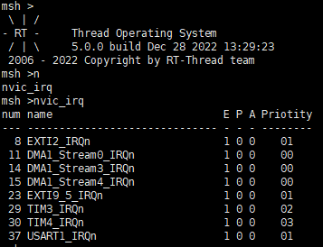

优先级排序：

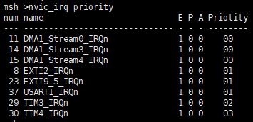

## 12. 注意事项

- 本软件包依赖控制台输出，请先确认控制台设备可用；
- 当前在线包配置入口依赖 `SOC_FAMILY_STM32`；
- 当前实现中的 IRQ 名称表是按 STM32 系列分别维护的；
- `set` 命令是运行时修改，不等价于修改 BSP/驱动初始化代码；
- 若项目未启用 MSH / FinSH，则无法通过命令行调用该组件；
- 若某 IRQ 未使能，则不会出现在 IRQ 列表中。

## 13. 许可证

本项目遵循 **LGPL-2.1** 许可证。详情请参见 `LICENSE` 文件。

## 14. 维护信息

- Maintainer: `wdfk-prog`
- Repository: `https://github.com/wdfk-prog/rt-thread-get_irq_priority`

---

[切换到 English Version](./README.md)
